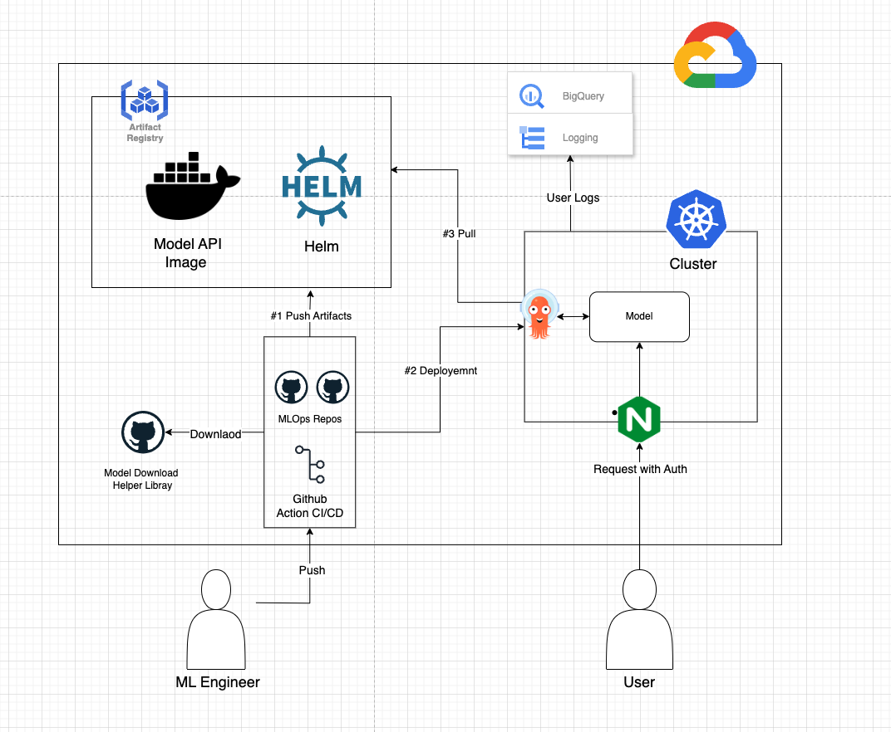
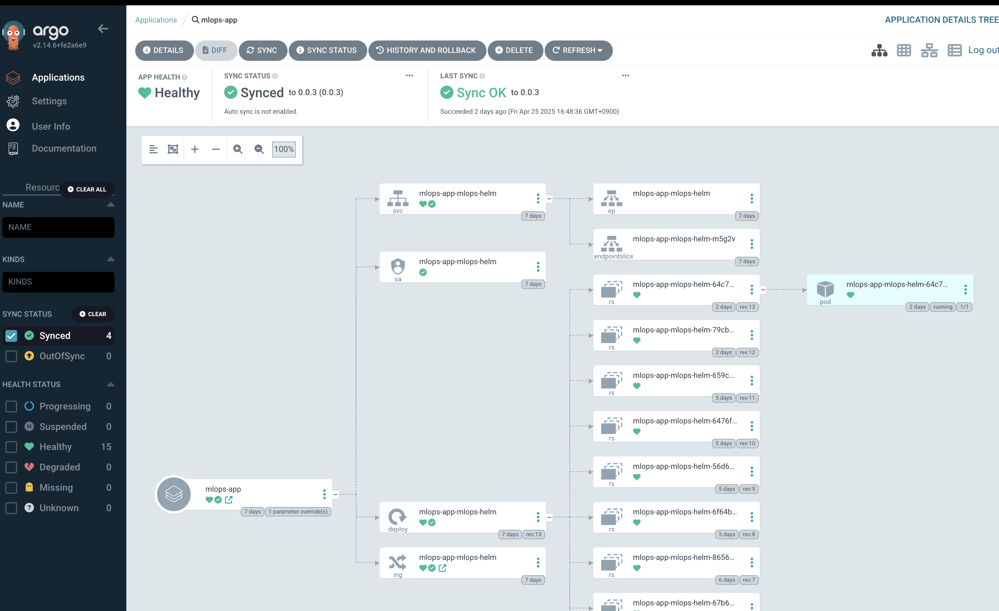

# MLOps Deployment Pipeline with T5 Summarization Model

This repository implements the lifecycle of an MLOps pipeline for deploying machine learning models as APIs using **GitHub Actions**, **Helm**, and **Kubernetes**. The workflow ensures:

- ✅ Automated CI/CD  
- ✅ Reproducible deployments  
- ✅ Reliable monitoring and logging  

- For this hands-on implementation, the deployed model is the **T5 NLP model** configured for **text summarization**. The deployed API allows users to input text and receive summarized output. All requests must include a valid **authorized token** for access.

## 📌 Overview

The architecture supports the following flow:

1. **Model Packaging & Artifact Push**
   - ML Engineers push model code and configurations to the GitHub repository.
   - CI/CD pipeline (GitHub Actions) builds the **Model API Image** and pushes it to the **Artifact Registry**.

2. **Model Deployment**
   - CI/CD triggers deployment using ArgoCD into the **Kubernetes Cluster**.
   - The model container is deployed through Helm charts and managed by ArgoCD.

3. **User Request Handling**
   - End-users send HTTP requests to the model API through **Nginx**, which handles authentication.
   - Requests are routed to the deployed **Model API** inside the Kubernetes cluster.

4. **Monitoring & Logging**
   - User logs and usage metrics are collected.
   - Logs are forwarded to **Google Cloud Logging** and can be analyzed using **BigQuery**.

---

## 📂 Components

### 🔹 Artifact Registry
- Stores **Docker images** and packaged **Helm charts**.
- These artifacts are pulled by the containers during deployment, which is automated and managed by **ArgoCD** running on the Kubernetes cluster.

### 🔹 Helm
- Manages **Kubernetes resources** and handles deployments via **Helm charts**.
- Activates **Nginx Ingress** for routing and enables **authentication** through Ingress configuration.

### 🔹 GitHub Repos & CI/CD (GitHub Actions)
- Contains MLOps workflows.
- Automates the process of:
  - Building Docker images.
  - Pushing artifacts.
  - Triggering deployments.

### 🔹 Kubernetes Cluster
Hosts the model inference service.

### 🔹 ArgoCD
- Manages **continuous deployment** and ensures that the Kubernetes cluster state matches the configurations defined in the Git repository (**GitOps** approach).
- Supports deployment with **static IP** and **Cloud DNS domain settings** configured via **Google Cloud Platform (GCP)**.

### 🔹 Google Cloud Logging & BigQuery
- Enables **monitoring**, **log aggregation**, and **analytics** for the deployed model APIs.
- Supports **counting API calls per user** by analyzing logs, which allows for usage monitoring, rate-limiting, and identifying frequent users.
- API request logs can be exported from **Google Cloud Logging** to **BigQuery**, where SQL queries can be used to aggregate metrics such as:
  - Number of requests per user.
  - Request patterns over time.
  - Error rates and success rates.

## 🚀 Workflow Details

This section explains the automated process of deploying the model and serving requests through the CI/CD pipeline.

### 1️⃣ Code Push by ML Engineer
- ML engineer pushes code or configuration changes to the `main` or `feature/CICD` branches.
- The pipeline is triggered automatically.

---

### 2️⃣ Build & Push (GitHub Actions)
- **Checkout** the latest code.
- **Authenticate** with GCP using the service account key.
- **Build Docker image** and **push** it to the Artifact Registry.
- (Optional) Package and push updated **Helm charts**.

---

### 3️⃣ Deploy & Sync (ArgoCD)
- **Login** to ArgoCD using CLI.
- **Create or update** the ArgoCD application with the new image and Helm chart.
- **Sync deployment** to apply changes to the Kubernetes cluster.
- **Restart deployment** to ensure the latest image is running.

---

### 4️⃣ Request Handling via Nginx Ingress
- **Nginx Ingress** receives incoming HTTP requests.
- **Authentication** is enforced (e.g., token-based).
- Routes requests to the deployed **Model API service**.

---

### 5️⃣ Model Serving & Monitoring
- The **T5 Summarization Model API** handles inference requests and returns summarized results.
- **Logs** are collected via Google Cloud Logging.
- Usage data (e.g., **API calls per user**) is analyzed through **BigQuery** for monitoring and reporting.
